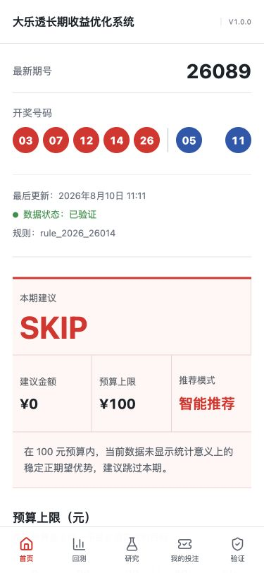

# 大乐透长期收益优化系统

**Probability · Backtest · Coverage · Budget Optimization**

这是一个公开、可复现、不会轻易骗自己的大乐透策略研究系统。唯一经营目标是在单期实际投入不超过 100 元时，检验选号、组合覆盖、预算择时和 Bet/Skip 是否真正改善长期净收益。系统不保证中奖或盈利；没有显著优势时，正式建议就是 **SKIP**。



## 当前状态

- 版本：V1.0.0
- 规则：`rule_2019_19019`、`rule_2026_26014`
- 数据：官方中国体育彩票开奖网关，SQLite 增量缓存
- 推荐：默认 Experimental；证据不足即 SKIP
- 在线网址：GitHub Pages 发布后由仓库设置生成

## 核心能力

- Atomic Bets 统一表示单式、复式和混合组合，真实成本绝不超过 100 元。
- 2019/2026 规则版本、固定/浮动奖、追加与税务聚合结算。
- 官方历史数据、校验警告、事务更新与原子缓存替换。
- Random、RandomCoverage、Frequency、HotCold、Bayesian、Entropy、CoOccurrence、Ensemble。
- Walk-forward、三层数据划分、Locked Holdout 单次验收、Forward Paper 不可变记录。
- 三重随机基准、Coverage baseline、随机 ROI 分布与 Jackpot Sensitivity。
- Greedy Coverage、重合度/Jaccard、单式/复式/混合预算规划。
- Monte Carlo Uniform Draw 与独立的 Historical Bootstrap。
- 手机优先首页、回测、数据研究、My Bets、Validation 页面。

## 安装与运行

```bash
python3 -m venv .venv
source .venv/bin/activate
python -m pip install -e .
python scripts/initialize_data.py
python -m unittest discover -s tests -v

cd web
npm install
npm run dev
```

历史初始化依赖访问中国体育彩票官方接口。常规更新：

```bash
python scripts/update_draws.py
python scripts/validate_data.py
python scripts/run_backtest.py --window 300 --budget 20 --random-seeds 100
python scripts/build_web_data.py
```

## 回测和验证

训练、验证、Locked Holdout 与 Forward Paper 完全分开。预测第 N 期只允许访问 N-1 及以前。Holdout 必须预先登记，验收后不能重跑成“同一次全新测试”。详细方法见 [methodology](docs/methodology.md)、[backtesting](docs/backtesting.md) 和 [statistical validation](docs/statistical_validation.md)。

## GitHub Actions 与 Pages

- `update-draws.yml`：定时及手工更新开奖、校验并生成静态 JSON。
- `settle-generate.yml`：定时及手工结算旧推荐并生成下一期 Paper recommendation。
- `deploy-pages.yml`：测试、构建并部署 GitHub Pages。

所有工作流失败时不会把未校验的临时数据替换为正式快照。Vite 使用相对资源路径与 hash 路由，Pages 刷新不会依赖服务器端路由。

## 风险说明

本系统用于概率统计、组合优化及策略回测研究，不保证中奖或盈利。彩票开奖结果具有随机性，请严格控制投注金额。中奖很多但长期亏损仍然是失败策略。

## License

MIT。研究过的公开项目和许可证记录见 [THIRD_PARTY_NOTICES.md](THIRD_PARTY_NOTICES.md)。
